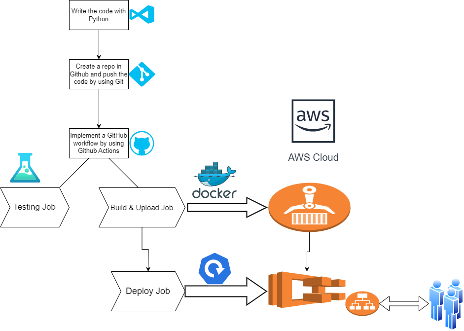
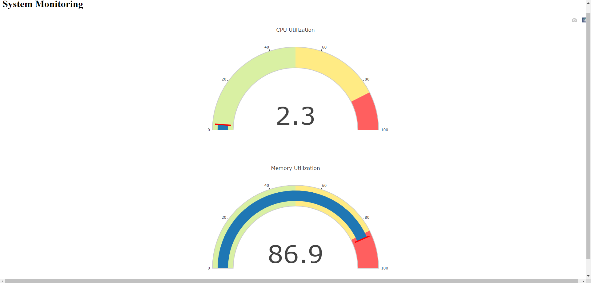
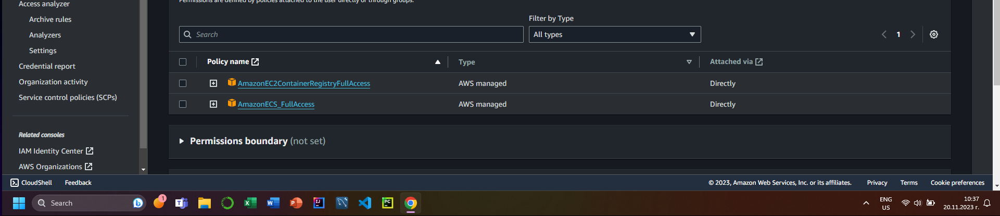
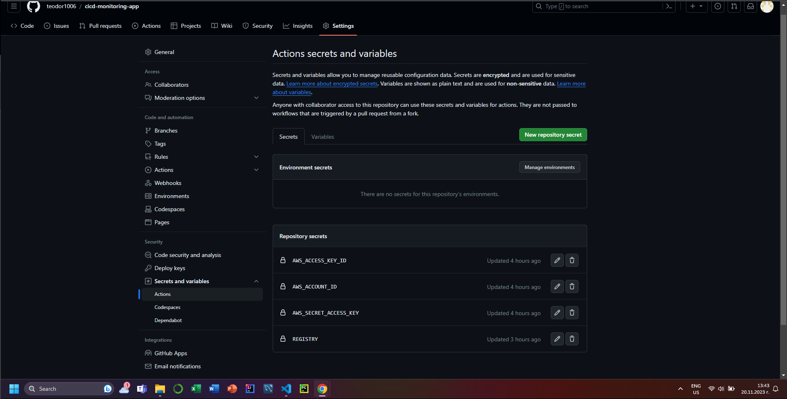
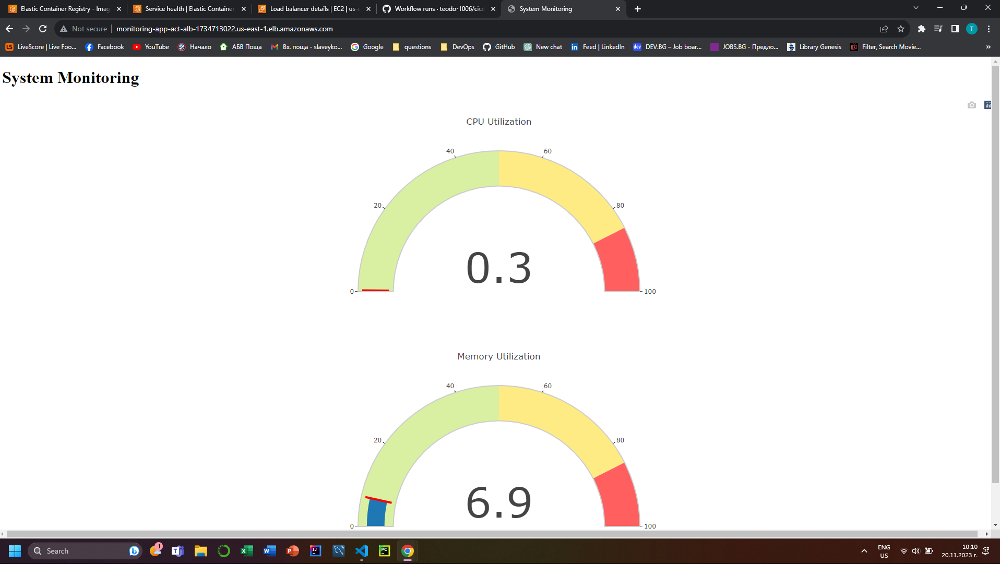
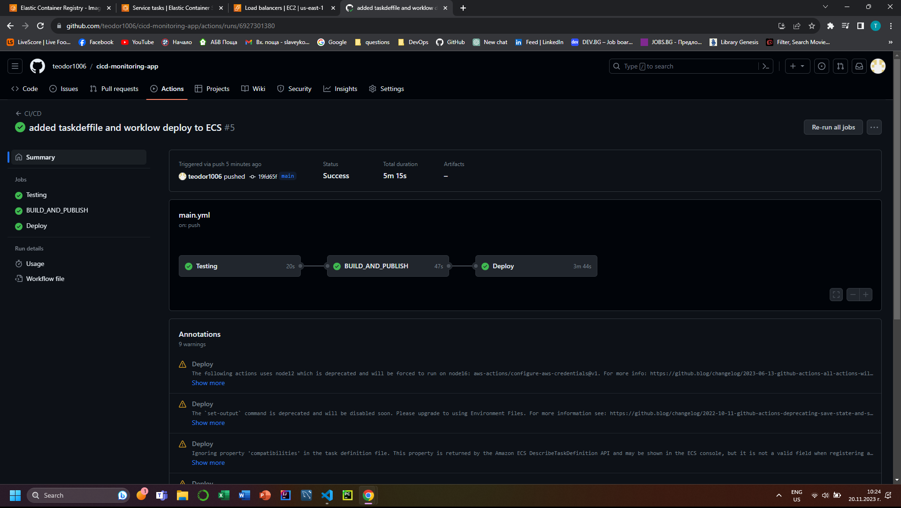
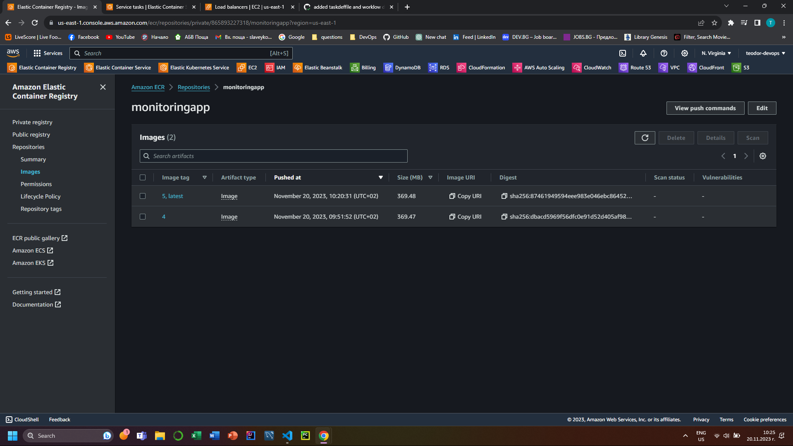
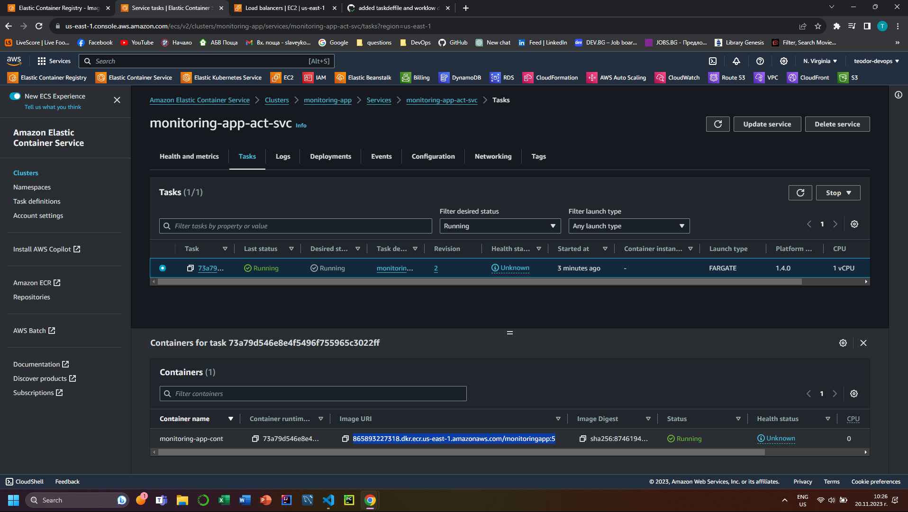

# **CI/CD for Cloud Native Monitoring Pthon App with GitHub Actions**

## Things you will Learn 🤯

1. How to create Monitoring Application in Python by using Flask and psutil
2. How to run a Python App locally.
3. Create AWS ECR repository 
4. Create AWS ECS Cluster with Service & Task Definition
5. Write a workflow for CI/CD with GitHub Actions



## **Prerequisites** 

(Things to have before starting the projects)

- [x]  AWS Account.
- [x]  Programmatic access and AWS configured with CLI.
- [x]  Python3 Installed.
- [x]  Docker installed.
- [x]  Code editor (Vscode)

# Let’s Start the Project 

## **Part 1: Deploying the Flask application locally**

### **Step 1: Clone the code**

Clone the code from the repository:

```
git clone <repository_url>
```

### **Step 2: Install dependencies**

The application uses the **`psutil`** and **`Flask`, Plotly** libraries. Install them using pip:

```
pip3 install -r requirements.txt
```

### **Step 3: Run the application**

To run the application, navigate to the root directory of the project and execute the following command:

```
python3 app.py
```

This will start the Flask server on **`localhost:5000`**. Navigate to [http://localhost:5000/](http://localhost:5000/) on your browser to access the application.



## **Part 2: Create an AWS ECR Repository**

### **Step 1: Create a Dockerfile**

Create a **`Dockerfile`** in the root directory of the project with the following contents:

```
# Use the official Python image as the base image
FROM python:3.9-slim-buster

# Set the working directory in the container
WORKDIR /app

# Copy the requirements file to the working directory
COPY requirements.txt .

RUN pip3 install --no-cache-dir -r requirements.txt

# Copy the application code to the working directory
COPY . .

# Set the environment variables for the Flask app
ENV FLASK_RUN_HOST=0.0.0.0

# Expose the port on which the Flask app will run
EXPOSE 5000

# Start the Flask app when the container is run
CMD ["flask", "run"]
```

### **Step 2: Create a IAM User with the following policies**



### **Step 3: Store some AWS secrets in your GitHub Repo**



### **Step 4: Create ECR Repo**

Open your AWS Account and change the region to N.Virginia(us-east-1).
Then go to ECR and create repository:

```
General Settings:
Visibility settings: private
Repository name: <your repo name>

Keep the rest as default
```

After that go to your GitHub Repo -> Settings -> Secrets and Variables -> Actions -> New Repository Secret. Store the name of your Registry in there.

### **Step 5: Write a workflow with GitHub Actions and push the docker image to ECR Repo**

Open visual studio code and create a new folder with the name: .github/workflows
Create an main.yml file and put the following code in there:

```
name: CI/CD

on:
  push:
    branches: 
      - main

env:
  AWS_REGION: us-east-1
  
jobs:
  Testing:
    runs-on: ubuntu-latest

    steps:
      - name: Checkout repository
        uses: actions/checkout@v4

      - name: Setup Python
        uses: actions/setup-python@v4
        with:
          python-version: 3.9

      - name: Install dependencies
        run: |
          python -m pip install --upgrade pip
          pip install -r requirements.txt

      - name: Run tests
        run: python -m unittest unittests.py


  BUILD_AND_PUBLISH:
    needs: Testing
    runs-on: ubuntu-latest
    steps: 
      - name: Checkout repository
        uses: actions/checkout@v4

      - name: Build & Upload Image to ECR
        uses: appleboy/docker-ecr-action@master
        with: 
          access_key: ${{ secrets.AWS_ACCESS_KEY_ID }}
          secret_key: ${{ secrets.AWS_SECRET_ACCESS_KEY }}
          registry: ${{ secrets.REGISTRY }}
          repo: monitoringapp
          region: ${{ env.AWS_REGION }}
          tags: latest,${{ github.run_number }}
          daemon_off: false
          dockerfile: ./Dockerfile
          context: ./

```

Push the changes to your GitHub Repo. Go to actions and on the left side click on CI/CD (your workflow name). Alert should have been triggered. Make sure the workflow has completed successfully! After that you should see the docker image in your ECR repo.


## **Part 3: Create an AWS ECS Cluster with Service & Task Definition**

### **Step 1: Create an AWS ECS Cluster**

Open your AWS Account again and make sure that you are in N.Virginia(us-east-1).
Then go to ECS and create cluster:

```
Cluster Configuration:
Cluster name: <your cluster name>

Infrastructure:
AWS Fargate (serverless)

Tags:
Name: <your tag name>
```
Wait then some minutes until the cluster is created.

### **Step 2: Create an AWS ECS task definition**

Go to ECS and click on Task definitions -> Create new task definition

```
Task definition configuration:
Task definition family: <your task definition name>

Infrastructure Requirements:
AWS Fargate
CPU: 1vCPU
Memory: 2GB

Task roles:
Task execution role: Create new role

Container details:
Name: <your container name>
Image URI: <your Image URI>    -> you can see it in your ECR Repo
Container port: 5000 

Tags:
Name: <your tag name>

Keep everything else as default.
```
After creating the task, click on ecsTaskExecutioRole and add the following policies by clicking on Add permissions -> Attach policies:

```
AmazonECSTaskExecutionRolePolicy
CloudWatchLogsFullAccess

```

### **Step 3: Create an AWS ECS Cluster Service**
Open your created cluster and go to Create service:

```
Environment:
Compute Options: Capacity provider strategy -> Use custom (Advanced) -> FARGATE

Deployment Configuration:
Application type: Service
Family: <your task definition name>
Service name: <your service name>
Service type: Replica
Desired tasks: 1

Deployment Options:
Deployment type: Rolling update
Min running tasks %: 100
Max running tasks %: 200

Deployment failure detection:
Uncheck: Use the Amazon ECS deployment circuit breaker

Networking:
Security group:
Create a new security group:
Security group name: <your security group name>
Security group description: <your description>
Inbound rules:
HTTP: Port 80 from Anywhere
Custom TCP: Port 5000 from Anywhere

Load Balancer: Application Load Balancer
Create a new load balancer:
Load balancer name: <your ALB name>

Listener:
Create new listener:
Port 80, Protocol HTTP
Target group:
Create new target group:
Target group name: <your tg name>
Keep the rest as it is.

Tags:
Name: <your tag name>
```
Wait for 10-15 minutes to create the cluster service!

### **Step 4: Check the app from the Load Balancer Endpoint**
After creating the cluster service go to AWS EC2 -> Load Balancers and click on your Application Load Balancer.
Go to Details, copy your DNS name and enter it in the browser.



## **Part 4: Deploy the Code to ECS by updating the workflow**

### **Step 1: Copy your taskdeffile.json file from AWS ECS task definitions**

Go to ECS -> Task Definitions -> Click on your task definition -> Revision -> JSON -> Copy to clipboard \
Go to VSCode -> Create a file: taskdeffile.json and paste the info that you copied.

### **Step 2: Update the workflow**

```
name: CI/CD

on:
  push:
    branches: 
      - main

env:
  AWS_REGION: us-east-1
  ECS_REPOSITORY: monitoringapp
  ECS_SERVICE: monitoring-app-act-svc
  ECS_CLUSTER: monitoring-app
  ECS_TASK_DEFINITION: ./taskdeffile.json
  CONTAINER_NAME: monitoring-app-cont

jobs:
  Testing:
    runs-on: ubuntu-latest

    steps:
      - name: Checkout repository
        uses: actions/checkout@v4

      - name: Setup Python
        uses: actions/setup-python@v4
        with:
          python-version: 3.9

      - name: Install dependencies
        run: |
          python -m pip install --upgrade pip
          pip install -r requirements.txt

      - name: Run tests
        run: python -m unittest unittests.py


  BUILD_AND_PUBLISH:
    needs: Testing
    runs-on: ubuntu-latest
    steps: 
      - name: Checkout repository
        uses: actions/checkout@v4

      - name: Build & Upload Image to ECR
        uses: appleboy/docker-ecr-action@master
        with: 
          access_key: ${{ secrets.AWS_ACCESS_KEY_ID }}
          secret_key: ${{ secrets.AWS_SECRET_ACCESS_KEY }}
          registry: ${{ secrets.REGISTRY }}
          repo: monitoringapp
          region: ${{ env.AWS_REGION }}
          tags: latest,${{ github.run_number }}
          daemon_off: false
          dockerfile: ./Dockerfile
          context: ./

  Deploy:
    needs: BUILD_AND_PUBLISH
    runs-on: ubuntu-latest
    steps:
      - name: Code checkout
        uses: actions/checkout@v4

      - name: Configure AWS credentials
        uses: aws-actions/configure-aws-credentials@v1
        with:
          aws-access-key-id: ${{ secrets.AWS_ACCESS_KEY_ID }}
          aws-secret-access-key: ${{ secrets.AWS_SECRET_ACCESS_KEY }}
          aws-region: ${{ env.AWS_REGION }}

      - name: Fill in the new image ID in the Amazon ECS task definition
        id: task-def
        uses: aws-actions/amazon-ecs-render-task-definition@v1
        with:
          task-definition: ${{ env.ECS_TASK_DEFINITION }}
          container-name: ${{ env.CONTAINER_NAME}}
          image: ${{ secrets.REGISTRY }}/${{ env.ECS_REPOSITORY }}:${{ github.run_number }}
    
      - name: Deploy Amazon ECS task definition
        uses: aws-actions/amazon-ecs-deploy-task-definition@v1
        with:
          task-definition: ${{ steps.task-def.outputs.task-definition }}
          service: ${{ env.ECS_SERVICE }}
          cluster: ${{ env.ECS_CLUSTER }}
          wait-for-service-stability: true    
```

After updating your workflow, push the code to GitHub and alert should have been triggered. Wait for some minutes in order the workflow to complete successfully!



After that open your ECR -> Repositories -> Images. You should see your images (latest,etc.)



You can also check your Image URI from your ECS Cluster -> Tasks




## **Part 5: Delete your AWS ECS Cluster**

Go to your AWS ECS Cluster -> Service -> Delete your Service -> Delete your Cluster
You can keep your ECR Repo, Security Groups, ect. You won`t get charged for that.
